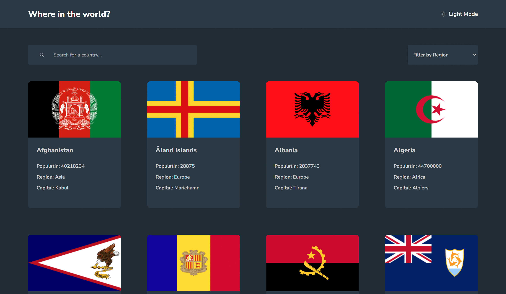

# Frontend Mentor Sitesine Ait Advanced Kategorisindeki Uygulamalar

Merhabalar, bu repoda [ "Frontend Mentor"_](https://www.frontendmentor.io/challenges?difficulty=4) sitesine ait advanced kategorisindeki yaptığım uygulamalar yer alıyor.

---

## Uygulama 1: React + Vite ile Hazırlanan Countries Uygulaması

Bu uygulama, dünya ülkeleri hakkında bilgi sunmayı amaçlayan bir web uygulamasıdır. Ülke adına göre arama yapabilir, koyu veya açık tema arasında geçiş yapabilir, kıtalara göre ülkeleri listeleyebilir ve seçilen bir ülkenin komşu ülkelerini görebilirsiniz.

Uygulama Sayfası: https://www.frontendmentor.io/challenges/rest-countries-api-with-color-theme-switcher-5cacc469fec04111f7b848ca

Demo: https://react-nobetci-eczane-uygulamasi.vercel.app/

### Özellikler
* **Ülke Araması:** Ülke adını yazarak detaylı bilgiye ulaşabilirsiniz.
* **Tema Seçimi:** Koyu veya açık tema arasından tercih yapabilirsiniz.
* **Kıta Bazlı Listeleme:** Kıtalara göre ülkeleri listeleyebilir ve inceleyebilirsiniz.
* **Komşu Ülkeler:** Seçilen ülkenin komşu ülkelerini görebilirsiniz.
* **Detaylı Bilgiler:** Her ülke için başkent, nüfus, dil, para birimi gibi detaylı bilgiler sunulur.
* **Responsive Design:** Farklı ekran boyutlarında sorunsuz çalışır.

### Kullandığım Teknolojiler:
- React + Vite.
- React Router DOM.
- Redux Toolkit.

### Kurulum ve Kullanım:
- **Adım 1: Klonlama:** `git clone https://github.com/gokhandemr/frontend-mentor-advanced-challenges.git`
- **Adım 2: Proje Klasörünü Açma:** `cd frontend-mentor-advanced-challenges/react-countries-app/`
- **Adım 3: Npm Yükleme:** `npm install`
- **Çalıştırma:** `npm run dev`

---

## Uygulama 2: Rock Paper Scissors Game

Bu proje, klasik ve eğlenceli bir oyun olan Taş Kağıt Makas'ı bilgisayara karşı oynamanıza olanak tanır. Oyun, kullanıcıya karşı bilgisayarın rastgele seçtiği bir hamle ile oynanır.

Uygulama Sayfası: https://www.frontendmentor.io/challenges/rock-paper-scissors-game-pTgwgvgH

Demo: https://frontend-mentor-advanced-challenges-rock-paper-scissors.vercel.app/

### Özellikler
* **Kazanma, Kaybetme ve Beraberlik Durumları:** Oyunun sonucunu ekranda gösterir ve score bilgisini kaydeder.
* **Responsive Design:** Farklı ekran boyutlarında sorunsuz çalışır.

### Kullandığım Teknolojiler:
- JavaScript, HTML ve CSS.

### Kurulum ve Kullanım:

- **Adım 1: Klonlama:** `git clone https://github.com/gokhandemr/frontend-mentor-advanced-challenges.git`
- **Adım 2: Proje Klasörünü Açma:** `cd frontend-mentor-advanced-challenges/rock-paper-scissors/`
- **Çalıştırma:** `Oyunu "live-server" gibi herhangi bir yerel sunucu eklentisini yardımıyla açabilirsiniz.`

---

## İletişim

Soru, görüş ve önerileriniz için _gkhandemir96@gmail.com_ mail adresine mail atabilirsiniz.
