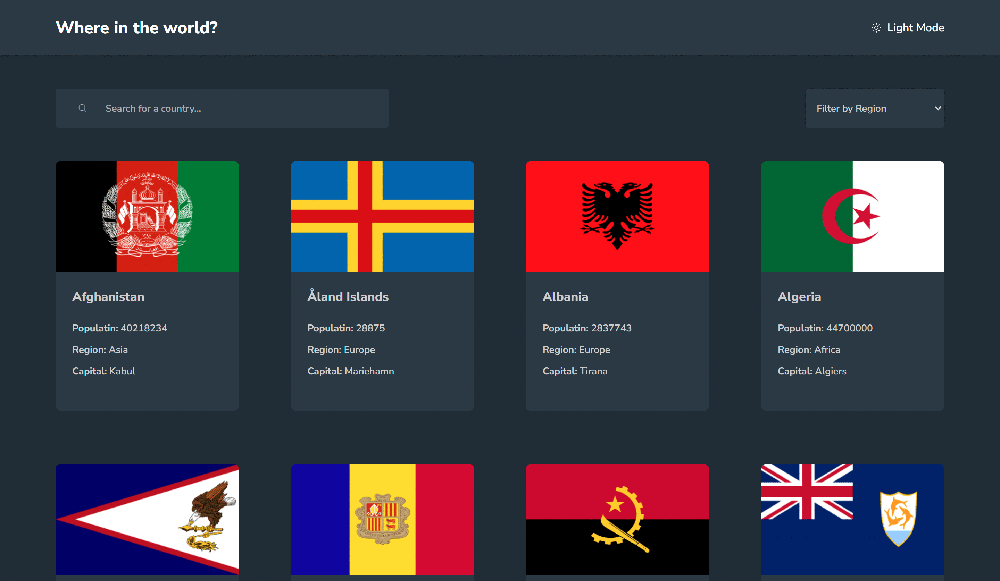

## Vite + React ile Hazırlanan Frontend Mentor Projesi

Selamlar, frontendmentor.io sitesinde yer alan [_"REST Countries API with color theme switcher"_](https://www.frontendmentor.io/challenges/rest-countries-api-with-color-theme-switcher-5cacc469fec04111f7b848ca) projesini Vite + React kullanarak, React Router DOM ve Redux Toolkit paketleri ile hazırladım.

Demo: https://frontend-mentor-advanced-challenges-react-countries-app.vercel.app/

---

### Bu Projede Yaptıklarım:

- Ülkelerin isimlerine göre arama yapılmasını sağlayan input alanı.
- Ülkeleri bölgelere göre filtreleme işlemi yapan select alanı.
- Ülkelere ait olan özel detay sayfaları.
- Açık ve koyu tema seçimi.
- Responsive tasarım.

---

### İletişim

_gkhandemir96@gmail.com_
